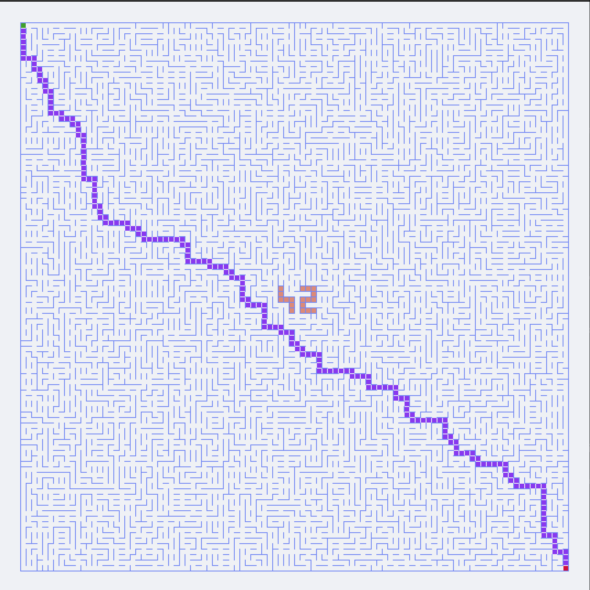
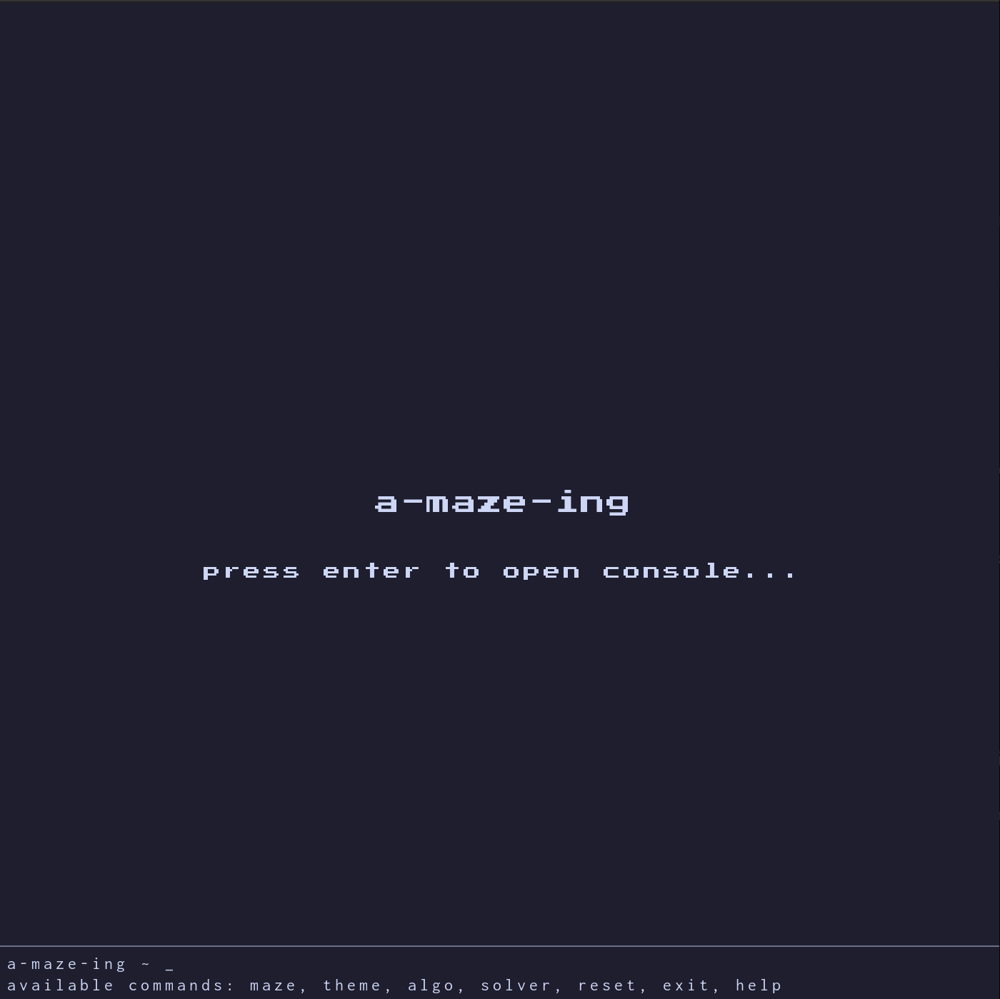
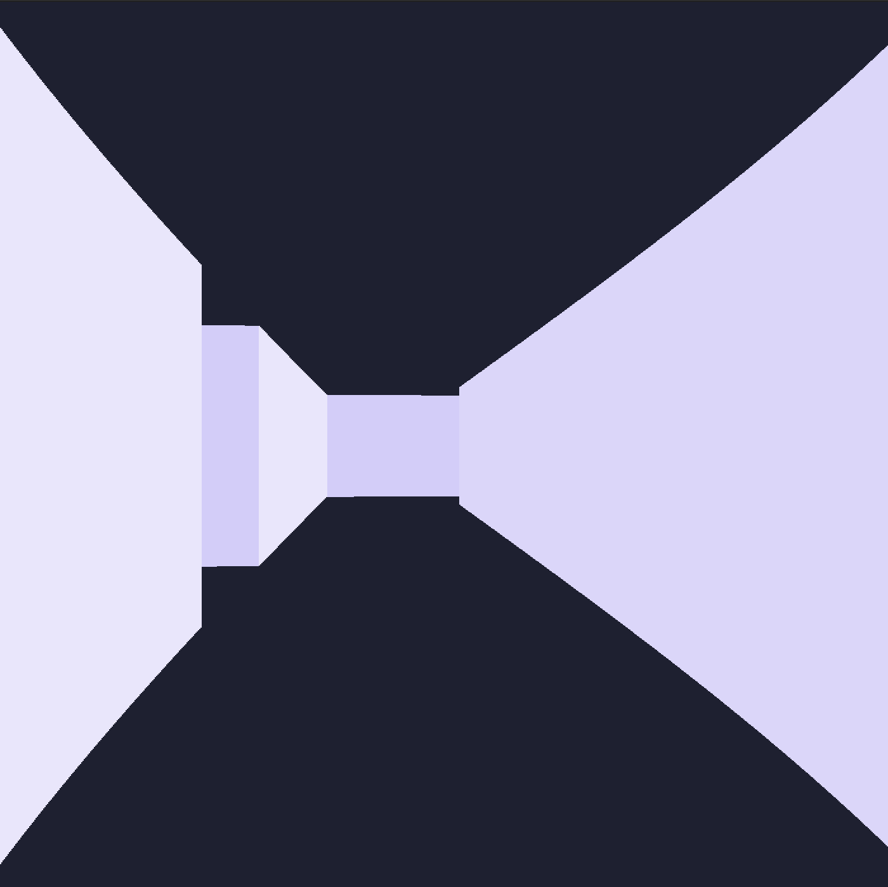
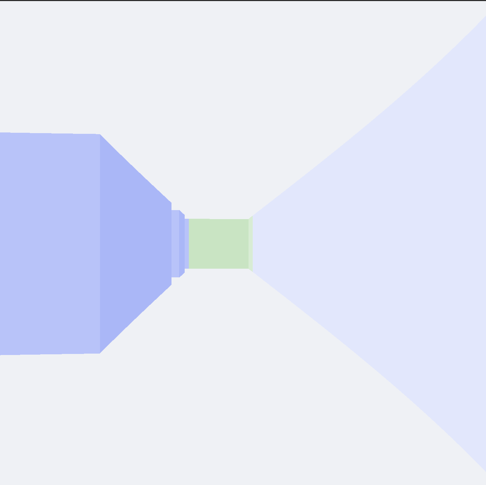

*This project has been created as part of the 42 curriculum by abounoua, arebilla*

# Project Name: A-Maze-ing

## Description
This project implements a **maze generation engine** that bridges theoretical computer science concepts ,  **graph theory**, **algorithm design**, **data structures** ,  with a fully interactive, visually rich application. 

It implements the following theoretical concepts:
- **Graph Theory:** Implementing "Perfect Mazes," which are technically Spanning Trees (graphs where any two nodes are connected by exactly one path, with no cycles).
- **Algorithm Design:** Using traversal or partitioning algorithms, such as **Depth-First Search (DFS)**, **Prim’s**, or **Kruskal’s**, to create structured patterns from random states.
- **Data Structures:** Efficiently managing cell states and adjacencies to optimize generation speed, even for large-scale grids.

It uses the following implementation techniques:
- **Configuration Management:** Decoupling logic from parameters by using an external configuration file to control the generation behavior.
- **Object oriented programming**: Custom MVC (Model-View-Controller) architecture structuring the GUI around clear separation of concerns, with dedicated controllers and components for input handling, state management, and rendering.
- **Graphic programming:**
  - Visual rendering of the maze using **MinilibX** (a minimalist X11 wrapper) including **animated visualization** of the generation process to illustrate algorithm behavior in real time.
  - **Raycasting engine**: A custom-built raycaster for immersive, first-person navigation within the generated structure.
- **Command Line Interface (CLI)**: A fully functional integrated terminal to execute real-time commands (algorithm swapping, maze regeneration, color palette selection...)
- **Memory efficient data handling** using numpy arrays and python memoryviews to optimize speed of critical tasks

<table>
  <tr>
    <td align="center" width="50%">
      <br>
      <em>Maze view with integrated terminal</em>
    </td>
    <td align="center" width="50%">
      <br>
      <em>Raycasting engine visualisation of the maze</em>
    </td>
  </tr>
  <tr>
    <td align="center" width="50%">
      <br>
      <em>Maze with different theme and solution</em>
    </td>
    <td align="center" width="50%">
      <br>
      <em>Maze generation animation</em>
    </td>
  </tr>
  <tr>
    <td align="center" width="50%">
      <br>
      <em>Customise the maze with your favourite catppuccin flavor!</em>
    </td>
    <td align="center" width="50%">
      <br>
      <em>About to exit the maze...</em>
    </td>
  </tr>
  <tr>
    <td align="center" width="50%">
      <br>
      <em>Generate mazes of different shape by selecting different algorithms</em>
    </td>
    <td align="center" width="50%">
      <br>
      <em>Select between different resolution algorithms to find the optimal solution of a maze with multiple paths</em>
    </td>
  </tr>
</table>

---

## Instructions

### Installation
This project uses uv for dependency management: https://docs.astral.sh/uv/#installation

### Setup and run
```bash
make install                        # Install dependencies
make run                            # Run the program based on config.txt
uv run a-maze-ing my_config.txt     # Specify your own config file
```

---

## Configuration File
The configuration is define in the `config.txt` file at the root of the project.
The configuration file accepts only the following parameters.

| Parameter | Format | Required | Constraints | Example | 
| ----- | ----- | ----- | ----- | ----- | 
| WIDTH | integer | yes | min=2,max=349 | 10 |
| HEIGHT | integer | yes | min=2,max=349 | 10 |
| ENTRY | line,column | yes | min=0,max=348 | 0,0 |
| EXIT | line,column | yes | min=0,max=348 | 9,9 |
| OUTPUT_FILE | string | yes | minimum length=1 | output.txt |
| PERFECT | boolean | no | N/A | True |
| SEED | integer | no | N/A | 512786 |

*Example:*
```bash
# config.txt
WIDTH=80
HEIGHT=80
ENTRY=0,0
EXIT=19,14
OUTPUT_FILE=maze.txt
PERFECT=True
SEED=512786
```

---

## A-Math-ing Graph Theory: The Mathematics of Mazes

As this project has been called friendly *a-math-ing*, we want to bring you into a deep dive in mathematical maze representation. Let's begin with this graph theoretical introduction. 

Why do we care about Graph Theory in a maze generation project? Because to a computer, a maze is not a picture made of walls and empty spaces; it is a mathematical structure called a **Graph**. 

### 1. What is a Graph?

In mathematics and computer science, a graph is a structure used to model pairwise relations between objects. It is made of two fundamental components:
* **Nodes (or Vertices):** The individual entities or points. In our maze, every single walkable cell is a node.
* **Edges:** The lines or connections between the nodes. In our maze, if two adjacent cells don't have a wall between them, they are connected by an edge.

Graphs can be **weighted** (moving from node A to node B costs a certain amount of energy or time) or **unweighted** (every step has the exact same cost). By converting a 2D grid into a graph, we allow algorithms like Dijkstra or A* to navigate it mathematically.

### 2. The Spanning Tree

Now, imagine a graph with many interconnected nodes, forming multiple loops and alternative routes. A **Spanning Tree** is a specific sub-graph extracted from this main graph that satisfies two strict conditions:
1.  **It "Spans":** It must connect absolutely *every single node* of the original graph. No cell is left behind.
2.  **It is a "Tree":** It must contain **zero cycles (no loops)**. There is exactly one, and only one, unique path between any two nodes.

*Fun Fact:* What we call a "Perfect Maze" (a maze where every cell is reachable, but there are no loops around walls), is a Spanning Tree on a grid graph!

### 3. The Minimum Spanning Tree (MST)

Let's take it one step further. What if our graph is weighted? For example, building a corridor between Room A and Room B costs $10, but between Room B and Room C costs $2. 

A **Minimum Spanning Tree (MST)** is a Spanning Tree that connects all the vertices together with the **absolute minimum total edge weight**. It answers the question: *"How can I connect every single point in this network as cheaply as possible without creating any redundant loops?"*

Algorithms like **Kruskal's** or **Prim's** are famous for finding the MST. In maze generation, using randomized weights with these algorithms is one of the most beautiful ways to carve out complex, perfect mazes.

### 4. Graph Theory Applications in Real Life

Graph theory is not just for maze enthusiasts; it is the invisible backbone of our modern world. Here are a few ways these concepts are applied daily:
* **GPS and Navigation (A\* & Dijkstra):** Google Maps models cities as graphs (Intersections = Nodes, Roads = Edges) to compute the shortest path to your destination.
* **Telecommunications & Power Grids (MST):** When an energy company wants to wire a new neighborhood, they use Minimum Spanning Trees to figure out the layout that uses the least amount of copper cable while ensuring every house has power.
* **Social Networks:** On platforms like LinkedIn or Facebook, you are a node, and your friendships are edges. The "Degrees of Separation" concept is just finding the shortest path between two nodes in a massive social graph.
* **Biology and Medicine:** Graphs are used to model neural networks in the brain, or how different proteins interact with each other in genomics.
* **Logistics:** Delivery companies (like Amazon or FedEx) use complex graph algorithms to optimize their delivery routes, saving millions of gallons of fuel every year.


## Maze Generation
### Algorithm
#### Recursive Backtracking (Randomized Depth-First Search)

The recursive backtracking id an adaptation of the Depth-First-Search (DFS) algorithm for traversing a Tree or a Graph data structure. The algorithm starts at the root node and explores as far as possible along each branch before backtracking.

In this adaptation for a maze generation, the maze is modelled as a graph $(V, E)$ where each location in the maze is a vertice $V$ of the graph, and each passage between two adjacent location is an edge $E$. The graph is traversed by visiting each vertice a single time, the next vertice being randomly selected among the adjacent vertices. This allows to build a spanning tree of the maze graph, which can be converted in a perfect maze, each edge being a passage to an adjacent location.


The implementation of this algorithm is recursive. For large labyrinth, it is required in python to increase the recursion limit `sys.setrecursionlimit` to prevent hitting this limit.

The complexity of this algorithm is $O(n)$, where n is the size of the maze (width x height)

#### Kruskal's algorithm

This methodology is an adaptation of the Kruskal's algorithm. Kruskal's algorithm finds a minimum spanning tree of a graph. A minimum spanning tree of a connected weighted graph is a connected subgraph, without cycles, for which the sum of the weights of all the edges of the subgraph is minimal. 

In this adaptation for a maze generation, the maze is modelled as a graph $(V, E)$ where each location in the maze is a vertice $V$ of the graph, and each free passage between two adjacent location is an edge $E$. The edges are randomly sorted, which is equivalent to give them each a unique weight, and sort them by weight.

```python
@dataclass
class Edge:
    x: int
    y: int
    dir: Direction
```
At the start of the procedure, each vertice of the graph is associated with a Tree. The tree has 2 attributes, 
- `parent`: which is the parent node, or `None` if the node is the root of the tree.
- `rank`: which is the height of the tree.

It has 3 methods:
- `root`: returns the root of the tree.
- `is_connected`: check if two trees are connected, it means they share the same root.
- `union_by_rank`: connects two trees. The root of the tree with the highest rank becomes the root of the other tree. If the rank is equal, either tree becomes the new root, and its rank is increased by one.

The time complexity of these method is $O(log(n))$.

```python
class Tree:
    def __init__(self) -> None:
        self.parent: Tree | None = None
        self.rank = 0

    @property
    def root(self) -> Tree:
        if self.parent is None:
            return self
        return self.parent.root

    def is_connected(self, node: Tree) -> bool:
        return self.root == node.root

    def union_by_rank(self, node: Tree) -> None:
        self_root = self.root
        node_root = node.root
        if self_root.rank > node_root.rank:
            node_root.parent = self_root
        elif self_root.rank < node_root.rank:
            self_root.parent = node_root
        else:
            node_root.parent = self_root
            self_root.rank += 1

```


The procedure runs as follows
- The list of edges is randomly sorted.
- For each edge in the list, we check if the trees corresponding to the the vertices are connected. If they are not, we perform a union by rank. If they are connected, we continue to the next edge.


- Once all the edges have been checked, it remains a single connected Tree which is a spanning tree of the maze graph. Edges of this spanning tree are passages from one location to the adjacent one. A perfect maze can then be built from this spanning tree.

The overall complexity of this algorithm is $O(n log(n))$, where n is the size of the maze (width x height).


### Carving the Perfect Maze: Prim's Algorithm

To create a "Perfect Maze" a grid where every cell is reachable but there are absolutely no loops, Graph Theory tells us we need to build a **Spanning Tree**. 

To make the maze look organic and unpredictable, we assign random weights to all the walls (edges) in our grid and compute the **Minimum Spanning Tree (MST)**. To achieve this, we use **Prim's Algorithm**.

#### How the Algorithm Grows the Maze

Prim's algorithm builds the MST step by step, starting from a single point and growing outwards. Here is the exact process used to carve the maze:

1. **Initialization:** We pick a random starting cell and mark it as "visited" (part of the maze).
2. **The Frontier:** We look at all the walls separating this cell from its unvisited neighbors and consider them our current "frontier."
3. **The Greedy Choice:** We select the wall on the frontier with the lowest random weight.
4. **Carving:** We knock down that wall, linking the new cell to our maze. We mark this new cell as visited.
5. **Expansion:** We add the walls of this newly visited cell to our frontier.
6. **Repeat:** We continue picking the lowest-weight wall from the entire frontier until every single cell in the grid has been visited.

### The Mathematical Guarantee: The Cut Property

Prim's algorithm relies on a greedy strategy, it always takes the immediate cheapest option. Why doesn't this lead to a suboptimal tree in the long run? The answer lies in a fundamental theorem of graph theory: the **Cut Property**.

To formalize this mathematically, let our maze be a graph $G = (V, E)$, where $V$ represents the vertices (cells) and $E$ represents the edges (walls/paths). A "cut" is a partition of all vertices $V$ into two disjoint subsets: $S$ (the cells already annexed into our maze) and $V \setminus S$ (the unvisited cells).

Let $e_{min} = \{u, v\}$ be the edge connecting a node $u \in S$ to a node $v \in V \setminus S$ with the absolute minimum weight $w$. This is expressed as:

$$w(e_{min}) = \min \{ w(e) \mid e \text{ crosses the cut} \}$$

The Cut Property theorem dictates that this specific edge $e_{min}$ **must** belong to the Minimum Spanning Tree (MST). 

The mathematical proof relies on a contradiction: Imagine a hypothetical MST that *does not* include $e_{min}$. To connect all nodes, this flawed MST must cross the cut using some other edge, let's call it $e'$, where $w(e') > w(e_{min})$. If we remove $e'$ from this tree and replace it with $e_{min}$, we successfully reconnect the two subsets but with a strictly smaller total weight. This proves the initial tree wasn't the "Minimum" Spanning Tree after all. 

Therefore, by consistently selecting $e_{min}$ at every step across the expanding boundary, Prim's algorithm mathematically locks in the optimal final structure without ever needing to backtrack.

#### Under the Hood: The List Implementation

To make this generation process instantaneous, we cannot afford to scan the entire frontier array every time we need to find the lowest-weight wall. Just like our A* implementation, we can rely on a **Min-Heap (Priority Queue)**. However we didn't use a heap because the weights have to be picked randomly.

* **Insertion:** Every time a cell is added to the maze, its surrounding valid walls are pushed into the list.
* **Extraction:** At each iteration, we simply pop a random element of the list. In a real MST search, because of the heap's structure, this is guaranteed to be the lowest-weight wall on the entire frontier.
* **Validation:** We check if the wall leads to an unvisited cell. If it does, we carve the path; if both cells are already in the maze, we simply discard the wall and pop the next one.

#### Complexity and Performance

Because Prim's algorithm processes edges through a priority queue, its performance profile is highly efficient and identical to A*:

* **Time Complexity:** $\mathcal{O}(E \log V)$, where $V$ is the number of cells and $E$ is the number of walls. Extracting the minimum weight wall from the heap takes $\mathcal{O}(\log V)$ time.
* **Space Complexity:** $\mathcal{O}(V)$ in the worst case. The Min-Heap needs to store the frontier walls, and we must maintain a data structure (like a boolean array or hash set) to track which cells have already been visited.

### Selection Rationale
[Explain why you chose this specific algorithm over others (e.g., complexity, visual style, efficiency).]

---

## Maze Solving
### Algorithm
#### Depth-First Search (DFS)

##### Introduction
Depth-First Search (DFS) is a classic algorithmic technique used for traversing or searching tree and graph data structures. In the context of our maze solver, it acts as a "blind" search algorithm that explores as far as possible down one path before retreating. Imagine walking through a maze by always keeping your right hand on the wall, DFS follows a very similar philosophy of exhaustive exploration along a single branch.

##### How it Works
The DFS algorithm operates using a Last-In, First-Out (LIFO) structure, typically implemented with a `Stack` (or via recursion). The step-by-step process is as follows:

1. **Start:** Begin at the maze's starting point and push it onto the stack.
2. **Explore:** Pop the current cell from the stack and mark it as visited.
3. **Check Neighbors:** Look at all adjacent, unvisited, and accessible cells (i.e., no walls blocking the way).
4. **Advance or Backtrack:** 
   * If there are available neighbors, push them onto the stack and move to the next one.
   * If there are no available neighbors (a dead end), the algorithm automatically backtracks by popping the next available cell from the stack.
5. **Finish:** The process repeats until the destination is reached or the stack is empty (meaning no solution exists).

##### Results and Path Quality
DFS is guaranteed to find a path to the exit if one exists. However, **it does not guarantee the shortest path**. Because it blindly plunges down the first available route, it often generates winding, visually suboptimal paths.

*Note:* The only scenario where DFS is guaranteed to find the *only* (and thus, shortest) path is if the maze is a "perfect maze." Mathematically, a perfect maze is a connected acyclic graph (a tree), meaning there are no loops and there is exactly one unique path between any two distinct cells.

##### Complexity and Performance
* **Time Complexity:** $O(V + E)$, where $V$ is the number of vertices (cells in the maze) and $E$ is the number of edges (open passages). Since each cell connects to a maximum of 4 neighbors in a 2D grid, $E \le 4V$, making the time complexity effectively $O(V)$.
* **Space Complexity:** $O(V)$ in the worst-case scenario. If the maze consists of a single, long, snake-like path, the recursion depth or stack size will grow proportionally to the total number of cells.
* **Performance:** DFS is extremely fast to execute and simple to implement. While it isn't ideal for finding optimized routes, it is highly efficient for simply determining *if* a maze is solvable or for exploring perfect mazes.

## From Blind Search to Smart Navigation: The A* Algorithm

As you read before, DFS really acts like a no-brain robot; it is like consistently following the right wall without asking ourselves any questions about the path we are taking to the end. So actually, we don't have any guarantee that we will find the shortest path with DFS. But what would you say if this robot actually had a compass, helping it to answer the simple question: "am I following the shortest path?"

That's exactly the idea which popped into the minds of Peter E. Hart, Nils John Nilsson and Bertram Raphael in 1968. At that time, the best-known pathfinding algorithm was the Dijkstra algorithm. Let's dive into the Dijkstra algorithm to understand the idea of these researchers.

The Dijkstra algorithm relies on a fundamental principle to find the shortest path in a maze. To find the shortest path to a cell X, we have to find the shortest path to its parent X - 1, and recursively to its parent X - 2, and so on. So basically, the best way to make sure of this is to jump to a cell only if we have definitely found the shortest path to it. To achieve this, Dijkstra keeps it simple: it maps every direct neighbor of the explored cells, and it jumps to the globally closest one based on its total accumulated cost from the start. That's it, mathematics guarantee us that we found the shortest path. 

Why, would you ask? Let's imagine that it is not the case. Suppose there is a secret path, unknown to our algorithm, that actually makes the distance shorter than what we found. This would imply that this secret path has at least one cell accessible with a smaller total cost than the path we chose. So why didn't Dijkstra find it based on its systematic choice of taking the cell with the smallest total cost from its map? It's actually impossible. Since the algorithm assumes that costs are consistent (positive), adding new costs on top of an already higher path cost can never make it smaller. Therefore, we are guaranteed that we always jump to a cell using the absolute shortest path.

#### Giving Dijkstra a Compass (The Heuristic)

However, researchers highlighted a major flaw: while Dijkstra always finds the shortest path, it is overly sensitive to every path. It focuses solely on the entry cost ($g(n)$). If a path has a small cost from the start, Dijkstra will systematically explore it, even if it is physically heading in the exact opposite direction of the exit! It explores in perfectly circular, blind waves.

To solve this, they gave Dijkstra a "compass" what we call in mathematics a heuristic ($h(n)$). Instead of just looking at the distance covered from the start, the A* algorithm evaluates cells based on a combined score:

$$f(n) = g(n) + h(n)$$

*(Total Score = Real cost from start + Estimated cost to the exit)*

To maintain Dijkstra's absolute mathematical guarantee (the ability to "lock" a cell's shortest path on the first visit and never look back), this heuristic must strictly follow two rules:

* **It must be Optimistic (Admissible):** The heuristic must never overestimate the true distance to the exit. **Mathematically, for any node $n$, it must satisfy $h(n) \le h^*(n)$, where $h^*(n)$ is the true minimum cost to reach the target from $n$.** By remaining strictly optimistic, we ensure the algorithm never prematurely discards the true shortest path out of unwarranted pessimism. In fact, the heuristic acts purely as a priority sorter, not a true distance calculator. When the algorithm reaches the target (where the heuristic becomes exactly $0$), it compares its true accumulated cost with the optimistic scores of all other pending paths. Because these remaining scores are strictly optimistic, we are absolutely certain that any other path will end up being strictly longer, guaranteeing we found the optimal route.
* **It must be Consistent (Monotonic):** The estimated cost must drop no faster than the real cost accumulates between two steps. **Mathematically, it must satisfy the triangle inequality: $h(n) \le c(n, n') + h(n')$, where $c(n, n')$ is the true step cost between a node $n$ and its neighbor $n'$.** This acts as a mathematical shield, guaranteeing that the total score $f(n)$ never decreases as we move forward. Think of it as the equivalent of Dijkstra's positive cost rule. It ensures that a path that currently seems longer to reach a node $n$ doesn't suddenly drop in score to become artificially better than a faster path to $n'$. By forcing the heuristic to decrease proportionally (it cannot plummet abruptly), we maintain a positive evolution of the total costs (since moving has a real cost). This ensures the heuristic never abstracts away the real cost, allowing us to confidently validate and lock a cell knowing no hidden path with a heavy entry cost will suddenly become more beneficial later. This consistency is the secret lock that allows A* to freeze a cell's cost on the very first visit, avoiding infinite recalculations.


#### Under the Hood: Implementation

To make this algorithm not just smart, but incredibly fast, the choice of data structures is critical. In this project, A* is implemented using a Min-Heap (Priority Queue).

#### The Min-Heap Structure

When the algorithm explores a maze, it discovers many neighboring cells that are put in a "waiting list" (the Open Set). At every single step, the algorithm must ask: *"Which of all these pending cells has the lowest $f(n)$ score?"*

If we used a standard list or array, the computer would have to scan the entire list every time, which is highly inefficient. Instead, we use a Min-Heap, a specialized binary tree structure where the parent node is always smaller than its children.

* **Insertion:** When we discover a new cell, we push it into the heap with its $f(n)$ score. The heap automatically bubbles it up to its correct position.
* **Extraction:** The cell with the absolute lowest $f(n)$ score is always waiting at the very top (the root) of the tree. We can extract it instantly.
* **Tracking:** Alongside the heap, a standard dictionary keeps track of the "came_from" relationships and the best $g(n)$ scores found so far for each cell. Crucially, every time we evaluate a cell and push its neighbors into the heap, we link each neighbor to its current parent in the path and mark it as validated. This allows us, once the exit is reached, to simply backtrack through this list of optimized parents to reconstruct the final shortest path.

#### Results and Path Quality

Because our heuristic (typically Manhattan distance) strictly respects the rules of admissibility and consistency, the A* implementation behaves flawlessly:

* **Optimal Path Guarantee:** It is mathematically guaranteed to find the absolute shortest path from the start to the end.
* **Surgical Precision:** Unlike Dijkstra, which floods the maze equally in all directions, A* is pulled towards the target. It ignores dead ends that are physically too far in the wrong direction, resulting in a dramatically lower number of explored cells. The path generated is both perfectly optimal and computed with minimal waste.

#### Complexity and Performance

Thanks to the Min-Heap implementation, the performance is highly optimized:

* **Time Complexity:** $\mathcal{O}(E \log V)$, where $V$ is the number of vertices (cells) and $E$ is the number of edges (navigable neighbors). In the worst-case scenario, pulling the lowest score from the heap takes $\mathcal{O}(\log V)$ time. Because A* uses a heuristic to aggressively prune the search space, the actual number of operations is practically much lower than pure Dijkstra.
* **Space Complexity:** $\mathcal{O}(V)$. The algorithm needs to store the Open Set (the heap) and the Closed Set (visited nodes mapping) in memory. In the absolute worst-case scenario (a completely open maze with no walls), it might store nearly all cells in memory before reaching the exit.

---

## Maze Display

### Building the Visual Engine: 2D Rendering with MLX

Generating and solving a maze mathematically is only half the battle; displaying it efficiently is a whole different challenge. For this project, we used **MLX**, a minimalist, low-level graphical wrapper for X11 (often used in C programming, but wrapped for Python here). 

MLX is designed to be as basic as possible. While it allows us to put pixels on a window or map GPU textures to the screen, it forces us to deal with very low-level interfaces. To draw our maze, we had to manipulate `memoryviews`, writing raw bytes directly into 1D image memory addresses. 

Here is how we overcame the technical limitations of MLX to build a robust 2D rendering engine:

<table>
  <tr>
    <td align="center" width="50%">
      <br>
      <em>Scalable 2D rendering with solution</em>
    </td>
    <td align="center" width="50%">
      <br>
      <em>Welcome screen with custom fonts and console</em>
    </td>
  </tr>
</table>

#### 1. Dynamic Maze Scaling
A major difficulty in maze rendering is handling unpredictable grid sizes. Displaying a massive 300x300 maze requires a vastly different approach than a simple 10x10 grid. We couldn't hardcode pixel sizes. 

To solve this, we implemented a dynamic auto-scaling formula. Given a fixed window of size $W \times H$ and a maze grid of $N_{cols} \times N_{rows}$, the engine calculates the maximum possible cell size $S_{cell}$ (in pixels) while maintaining a perfect square aspect ratio:

$$S_{cell} = \min\left(\left\lfloor \frac{W}{N_{cols}} \right\rfloor, \left\lfloor \frac{H}{N_{rows}} \right\rfloor\right)$$

This mathematical constraint ensures the maze always fits perfectly within the screen bounds, regardless of its topological complexity.

#### 2. Decentralized "Blind" Cell Rendering
Rendering intersecting walls on a grid can quickly become a geometric nightmare of overlapping pixels. To elegantly bypass this, we designed a decentralized, "blind" rendering system. 

Every cell is completely independent and unaware of its neighbors. It renders its own boundaries using a simple halving formula. If the desired global wall thickness is $T$, each cell draws an internal border of thickness $t_c$:

$$t_c = \frac{T}{2}$$

When two adjacent cells $A$ and $B$ draw their respective "half-walls" on their shared edge, the rendered pixels perfectly merge to form a single, seamless wall of the correct total thickness ($t_A + t_B = T$). This eliminated complex intersection logic and drastically sped up the rendering process.

#### 3. The `MlxManager` (OOP Architecture)
Because the Python MLX library is essentially a raw C-function wrapper, putting a pixel on the screen means dealing with 1D memory array pointer arithmetic. To convert a 2D coordinate $(x, y)$ into a 1D memory index, the engine must compute:

$$Index(x, y) = (y \times \text{size\_line}) + \left(x \times \frac{\text{bpp}}{8}\right)$$

*(Where `size_line` is the byte width of the image and `bpp` is bits-per-pixel).*

Exposing this directly to our main code would have resulted in a messy, hard-to-maintain architecture. To protect our application from this low-level engine complexity, we created a dedicated Object-Oriented wrapper: the `MlxManager`. This class acts as a shield, smoothly managing coordinate translations, window creation, image lifecycles, and memory protection.

#### 4. Custom Binary Typography Engine
One of MLX's biggest limitations is its inability to natively draw strings directly onto images, let alone support different fonts or dynamic font sizes. 

We couldn't settle for this limitation. To solve it, we built our own custom font mapping engine. We exported custom typography as binary files using GIMP. Our engine directly reads these binary fonts and maps them pixel-by-pixel into the MLX image `memoryview`. By mathematically computing the memory offset for each ASCII character $C$ based on the sprite sheet grid, we achieved high-performance custom text rendering without relying on external UI libraries.

#### 5. React-Inspired Component UI & Animations
Finally, a static maze isn't very engaging. We wanted to see the algorithms come to life!
By leveraging the MLX main loop and hooking into its event system, we implemented smooth animations for the maze generation and pathfinding processes. Furthermore, to keep the UI scalable and maintainable as the project grew, we designed a **component-based rendering architecture**, heavily inspired by modern frameworks like React. This allowed us to build modular, reusable UI elements that plug seamlessly into the MLX loop.


### Into the Third Dimension: Raycasting and the DDA Algorithm

While a 2D top-down view is great for debugging and observing pathfinding, we wanted to push the engine further by implementing a first-person 3D perspective. To achieve this within the constraints of our grid-based maze, we implemented a **Raycaster** utilizing the **Digital Differential Analyzer (DDA)** algorithm.

<table>
  <tr>
    <td align="center" width="50%">
      <br>
      <em>Raycasting using DDA Algorithm</em>
    </td>
    <td align="center" width="50%">
      <br>
      <em>Raycasting with entry special color</em>
    </td>
  </tr>
</table>

#### The DDA Algorithm: Trigonometric Precision
Raycasting works by shooting a ray from the player's position for every vertical stripe (pixel column) of the screen, spread across the player's Field of View (FOV). The computational challenge is finding exactly where each ray hits a wall. Stepping forward by an arbitrary small distance is inefficient and prone to visual glitches (missing thin corners).

Instead, we use **DDA**. Because our maze is a strict mathematical grid, DDA optimizes the search by jumping exactly from one grid-line intersection to the next. In our engine, this is calculated purely through trigonometry. For a ray cast at a specific angle $\alpha$, we compute the scaling factors (delta distances), which represent the length of the ray's hypotenuse required to cross exactly one vertical or horizontal grid cell:

$$\Delta \text{dist}_x = \left| \frac{1}{\cos(\alpha)} \right|$$
$$\Delta \text{dist}_y = \left| \frac{1}{\sin(\alpha)} \right|$$

By maintaining the accumulated distances to the next $X$ and $Y$ sides and using basic trigonometric steps ($\tan(\alpha)$ to find exact intersections), the algorithm simply steps through the integer grid coordinates $(mapX, mapY)$ until a wall is struck. This guarantees absolute mathematical precision, avoids fisheye distortion (using perpendicular distance correction), and ensures lightning-fast collision detection.

#### Curing the "Fisheye" Distortion
Finding the collision point is only step one. If we draw the wall heights using the raw Euclidean distance of the ray, the edges of the screen will appear warped and spherical, the infamous **"fisheye" distortion**. This optical illusion happens because rays cast at the extreme edges of our Field of View naturally travel a longer physical distance to hit a straight, flat wall compared to the ray looking dead ahead.

To fix this mathematically, we must project the raw distance onto the camera's perpendicular axis (the flat viewing plane). By multiplying the raw Euclidean distance $D_{raw}$ by the cosine of the difference between the ray's angle $\alpha$ and the player's central viewing angle $\theta$, we obtain the true perpendicular distance:

$$D_{perp} = D_{raw} \times \cos(\alpha - \theta)$$

Using this corrected perpendicular distance guarantees perfectly straight walls, absolute geometric precision, and a flawless 3D perspective.

#### Low-Level Memory Manipulation with NumPy
Python is notoriously slow for pixel-by-pixel rendering. A standard nested `for` loop computing rays and drawing pixels would reduce our framerate to a crawl. To bypass Python's interpreter overhead, the entire frame buffer is built and manipulated using **NumPy** arrays (`np.array`).

Instead of plotting pixels individually, we compute wall heights and construct vertical stripes directly in memory using vectorized NumPy slicing. The entire screen is calculated as an off-screen matrix in RAM, allowing us to process thousands of pixels simultaneously at C-level speeds.

#### High-Speed Frame Dumping via `int64`
The final, and often most critical, bottleneck in a Python renderer is the "frame dump", the process of transferring our completed NumPy buffer into the MLX `memoryview` to be drawn on the screen. 

Standard ARGB/RGBA pixels are 32 bits (4 bytes) each. Writing millions of 32-bit integers individually per frame creates a massive bottleneck on the CPU's memory bus. To maximize memory bandwidth, we implemented a low-level pointer optimization: **64-bit memory casting**.

By casting our NumPy pixel buffer and the target MLX memory map as flat arrays of `int64` (8 bytes) instead of `int32` (4 bytes) or `uint8` (1 byte), we force the CPU to write **two pixels per memory instruction cycle**. 

This 64-bit aligned frame dumping effectively cuts the memory transfer time in half. It allows us to blast the entire frame buffer from NumPy into the X11 wrapper instantaneously, ensuring the raycaster maintains a fluid, real-time framerate despite Python's usual graphical limitations.

## Features
### Basic Features

Use `ENTER` key to open console, `ESCAPE` key to close console.

```bash
a-maze-ing ~ help               # display available commands
a-maze-ing ~ exit               # exit program
a-maze-ing ~ reset              # return to home screen
a-maze-ing ~ maze               # display available sub-commands for maze
a-maze-ing ~ maze help          # display available sub-commands for maze
a-maze-ing ~ maze show          # display maze
a-maze-ing ~ maze regen         # generate a new maze
a-maze-ing ~ maze solve         # display maze solution
a-maze-ing ~ maze dump          # save maze to output file
```

### Advanced Features
```bash
a-maze-ing ~ theme              # display available themes
a-maze-ing ~ theme theme-name   # change theme to selected theme
a-maze-ing ~ algo               # display available maze generation algorithms
a-maze-ing ~ algo algo-name     # change maze generation algorithm and regenerate the maze
a-maze-ing ~ solver             # display available maze resolution algorithms
a-maze-ing ~ solver algo-name   # change maze resolution algorithm
a-maze-ing ~ maze animation     # run animated view of maze generation algorithm
a-maze-ing ~ maze raycaster     # run raycaster rendering
```

---

## Technical Implementation
### Reusability

The package `mazegen` is reusable in other context:

```bash
uv build                                                    # build mazegen package
python3 -m pip install dist/mazegen-0.1.0-py3-none-any.whl  # install the package with pip
```
Basic usage:
```python
from mazegen import (
    MazeExporter,
    MazeExportError,
    MazeGenerationAlgorithm,
    MazeGenerator,
    MazeSettings,
    MazeSolver,
    MazeSolvingAlgorithm,
)


def main():
    settings = MazeSettings(
        width=15,
        height=10,
        entry=(0, 0),
        exit=(14, 9),
        output_file="output.txt",
        perfect=True,
    )
    generator = MazeGenerator(settings)
    maze = generator.generate(MazeGenerationAlgorithm.KRUSKAL)
    solver = MazeSolver()
    solution = solver.solve(maze, MazeSolvingAlgorithm.ASTAR)
    try:
        MazeExporter().export(maze, solution)
    except MazeExportError as e:
        print(e)


if __name__ == "__main__":
    main()
```
---

## Project Management

### Team Roles
[Define the specific roles and responsibilities of each team member.]

### Planning & Evolution
[Describe your anticipated planning and how it evolved throughout the project duration.]

### Retrospective
* **What worked well:** [List successful aspects of the collaboration or development.]
* **Areas for improvement:** [List what could have been handled better.]

### Tools Used

[List any specific tools used for version control, debugging, task management, etc.]

- [uv](https://docs.astral.sh/uv/) - package and project manager
- [Conventional Commits](https://www.conventionalcommits.org/en/v1.0.0/) - Specification for writing structured commit messages

---

## Resources
### References
[List classic references: documentation, articles, tutorials, etc.]
#### Maze Generation Algorithms
- [Fundamentals of Maze Generation - Carnegie Mellon University](https://www.cs.cmu.edu/~112-f22/notes/student-tp-guides/Mazes.pdf)
- [Maze Generation algorithm - Wikipedia](https://en.wikipedia.org/wiki/Maze_generation_algorithm)
- [The Buckblog, assorted ramblings - Jamis Buck](https://weblog.jamisbuck.org/2011/2/7/maze-generation-algorithm-recap.html)
- [Prim's Algorithm](https://www.geeksforgeeks.org/dsa/prims-minimum-spanning-tree-mst-greedy-algo-5/)

#### Graph Theory
- [Théorie des graphes - Wikipedia](https://fr.wikipedia.org/wiki/Th%C3%A9orie_des_graphes)
- [Minimum Spanning Tree - Wikipedia](https://en.wikipedia.org/wiki/Minimum_spanning_tree)
- [MST Search with Prim](https://www.youtube.com/watch?v=20QfaLQPLqQ)

#### Maze Solving Algorithms
- [Research on the A Star Algorithm](https://www.researchgate.net/publication/370573811_Research_on_the_A_Star_Algorithm_for_Finding_Shortest_Path)
- [A Search Algorithm](https://www.geeksforgeeks.org/dsa/a-search-algorithm/)
- [DFS Graph Search](https://en.wikipedia.org/wiki/Depth-first_search)
- [Problem solving with heuristic](https://ocw.mit.edu/courses/16-410-principles-of-autonomy-and-decision-making-fall-2010/1aeeda66f03c6e6b414438865901cb43_MIT16_410F10_rec09_sol.pdf)
- [Introduction to heuristic](https://theory.stanford.edu/~amitp/GameProgramming/Heuristics.html)
- [Heap fundamentals](https://www.youtube.com/watch?v=XycnarZEBvQ)

#### Python Low Level Manipulation
- [Memoryview in Python](https://www.geeksforgeeks.org/python/memoryview-in-python/)
- [Numpy arrays introduction](https://numpy.org/doc/stable/reference/generated/numpy.array.html)

#### Display with MLX
- [MiniLibX unofficial documentation](https://harm-smits.github.io/42docs/libs/minilibx)
- [Raycasting complete tutorial](https://lodev.org/cgtutor/raycasting.html)
- [Raycasting mathematic fundamentals](https://github.com/Qpupier/Cub3D/blob/master/Algorithme_Cub3D.pdf)
- [Raycasting in Python](https://www.youtube.com/watch?v=E18bSJezaUE)

### AI Usage Disclosure
[Provide a description of how AI was used, specifying the exact tasks and parts of the project it assisted with.]
