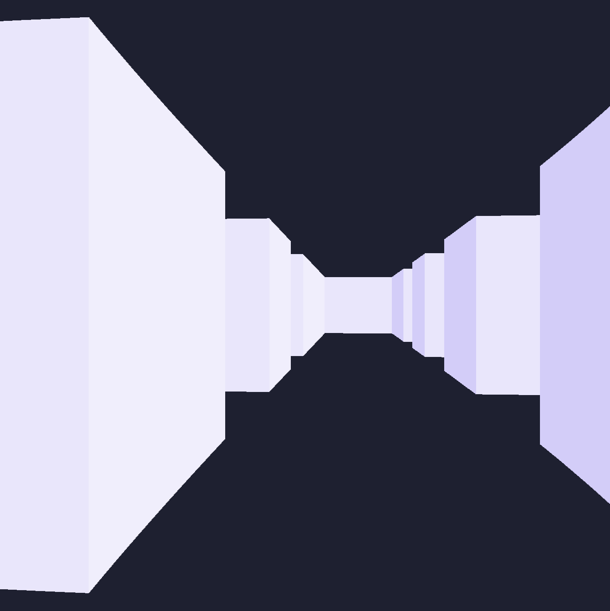
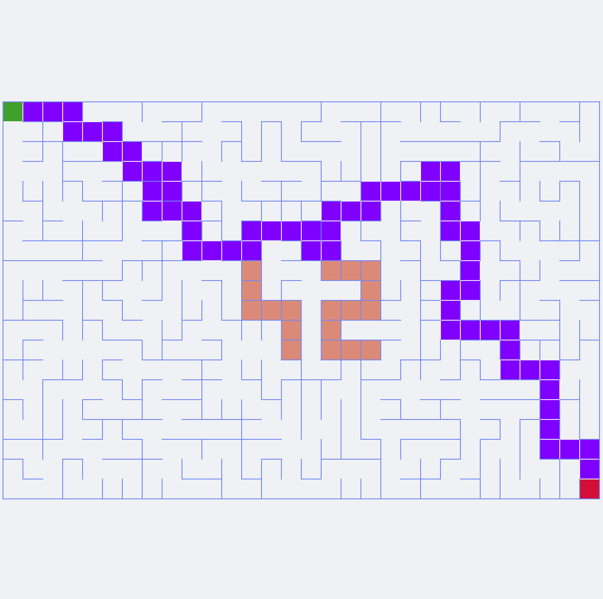
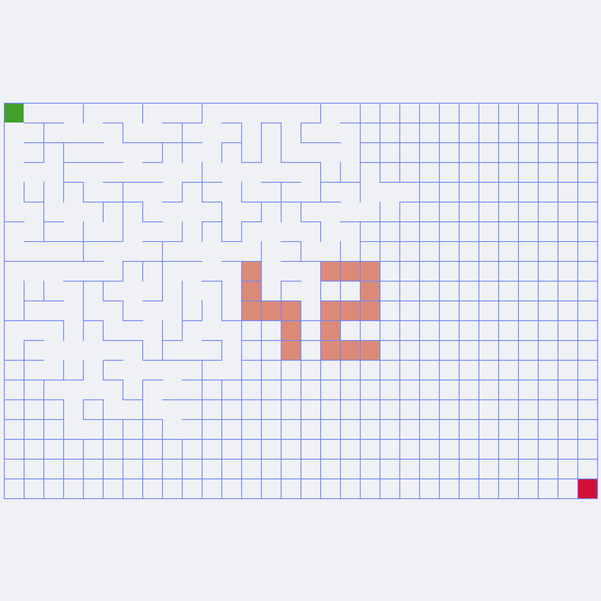
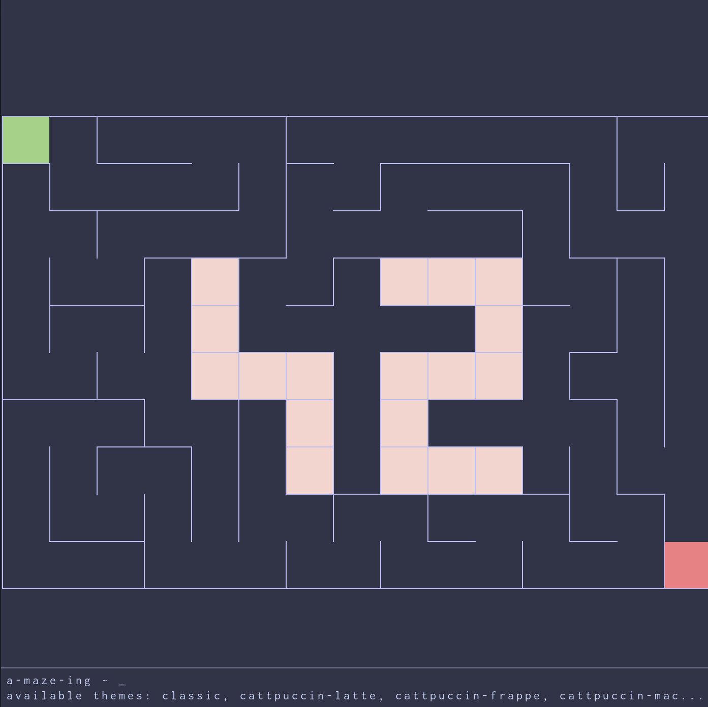
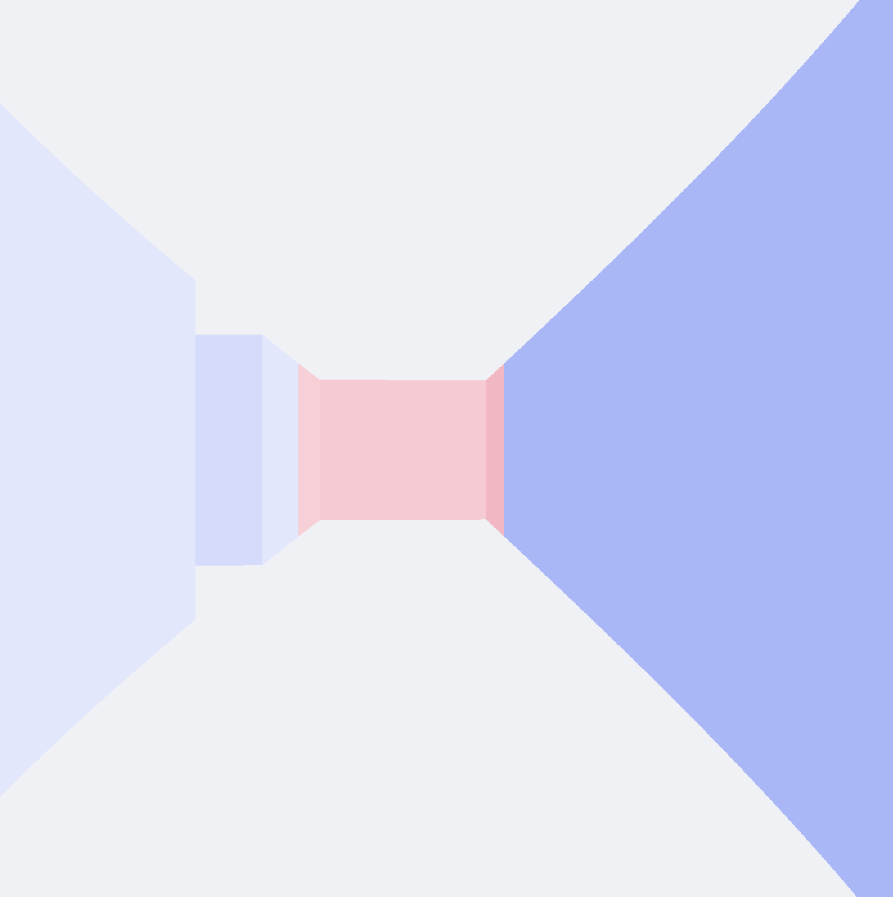
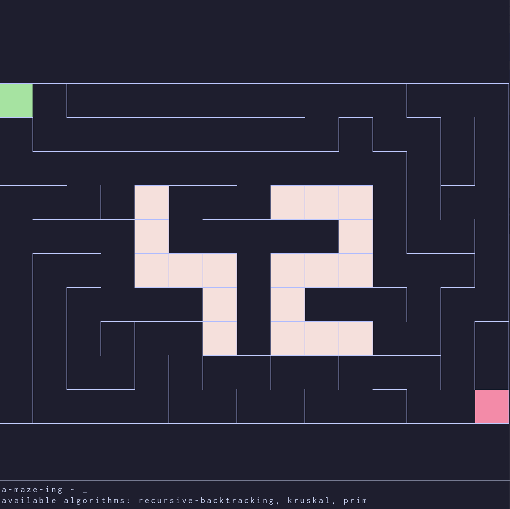
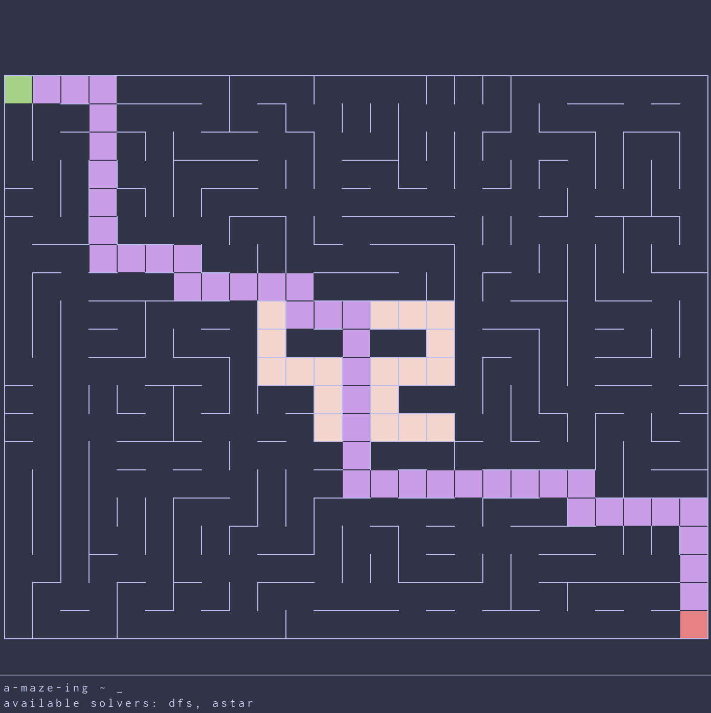

*This project has been created as part of the 42 curriculum by abounoua, arebilla*

# Project Name: A-Maze-ing

## Description
This project is a **maze generation engine** designed to explore fundamental concepts in **Graph Theory** and **Algorithm Design**. The primary goal is to transform an initial grid into a navigable structure by applying procedural generation techniques.

Building this tool serves as a practical application for several core computer science pillars:
- **Graph Theory:** Implementing "Perfect Mazes," which are technically Spanning Trees (graphs where any two nodes are connected by exactly one path, with no cycles).
- **Algorithm Design:** Using traversal or partitioning algorithms—such as **Depth-First Search (DFS)**, **Prim’s**, or **Kruskal’s**—to create structured patterns from random states.
- **Data Structures:** Efficiently managing cell states and adjacencies to optimize generation speed, even for large-scale grids.
- **Configuration Management:** Decoupling logic from parameters by using an external configuration file to control the generation behavior.
- **Graphic programming:**
  - Visual rendering of the maze using **MinilibX** (a minimalist X11 wrapper) including **animated visualization** of the generation process to illustrate algorithm behavior in real time.
  - **Raycasting engine**: A custom-built raycaster for immersive, first-person navigation within the generated structure.
  - **Command Line Interface (CLI)**: A fully functionnal integrated terminal to execute real-time commands (algorithm swapping, maze regeneration, color palette selection...)

<table>
  <tr>
    <td align="center" width="50%">
      <br>
      <em>Maze view with integrated terminal</em>
    </td>
    <td align="center" width="50%">
      <br>
      <em>Raycasting engine visualisation of the maze</em>
    </td>
  </tr>
  <tr>
    <td align="center" width="50%">
      <br>
      <em>Maze with different theme and solution</em>
    </td>
    <td align="center" width="50%">
      <br>
      <em>Maze generation animation</em>
    </td>
  </tr>
  <tr>
    <td align="center" width="50%">
      <br>
      <em>Customise the maze with your favourite catppuccin flavor!</em>
    </td>
    <td align="center" width="50%">
      <br>
      <em>About to exit the maze...</em>
    </td>
  </tr>
  <tr>
    <td align="center" width="50%">
      <br>
      <em>Generate mazes of different shape by selecting different algorithms</em>
    </td>
    <td align="center" width="50%">
      <br>
      <em>Select between different resolution algorithms to find the optimal solution of a maze with multiple paths</em>
    </td>
  </tr>
</table>

---

## Instructions

### Installation
This project uses uv for dependency management: https://docs.astral.sh/uv/#installation

### Setup and run
```bash
make install                        # Install dependencies
make run                            # Run the program based on config.txt
uv run a-maze-ing my_config.txt     # Specify your own config file
```

---

## Configuration File
The configuration is define in the `config.txt` file at the root of the project.
The configuration file accepts only the following parameters.

| Parameter | Format | Required | Constraints | Example | 
| ----- | ----- | ----- | ----- | ----- | 
| WIDTH | integer | yes | min=2,max=349 | 10 |
| HEIGHT | integer | yes | min=2,max=349 | 10 |
| ENTRY | line,column | yes | min=0,max=348 | 0,0 |
| EXIT | line,column | yes | min=0,max=348 | 9,9 |
| OUTPUT_FILE | string | yes | minimum length=1 | output.txt |
| PERFECT | boolean | no | N/A | True |
| SEED | integer | no | N/A | 512786 |

*Example:*
```bash
# config.txt
WIDTH=80
HEIGHT=80
ENTRY=0,0
EXIT=19,14
OUTPUT_FILE=maze.txt
PERFECT=True
SEED=512786
```

---

## Maze Generation
### Algorithm
#### Recursive Backtracking (Randomized Depth-First Search)

The recursive backtracking id an adaptation of the Depth-First-Search (DFS) algorithm for traversing a Tree or a Graph data structure. The algorithm starts at the root node and explores as far as possible along each branch before backtracking.

In this adaptation for a maze generation, the maze is modelled as a graph $(V, E)$ where each location in the maze is a vertice $V$ of the graph, and each passage between two adjacent location is an edge $E$. The graph is traversed by visiting each vertice a single time, the next vertice being randomly selected among the adjacent vertices. This allows to build a spanning tree of the maze graph, which can be converted in a perfect maze, each edge being a passage to an adjacent location.



The implementation of this algorithm is recursive. For large labyrinth, it is required in python to increase the recursion limit `sys.setrecursionlimit` to prevent hitting this limit.

The complexity of this algorithm is $O(n)$, where n is the size of the maze (width x height)

#### Kruskal's algorithm

This methodology is an adaptation of the Kruskal's algorithm. Kruskal's algorithm finds a minimum spanning tree of a graph. A minimum spanning tree of a connected weighted graph is a connected subgraph, without cycles, for which the sum of the weights of all the edges of the subgraph is minimal. 

In this adaptation for a maze generation, the maze is modelled as a graph $(V, E)$ where each location in the maze is a vertice $V$ of the graph, and each free passage between two adjacent location is an edge $E$. The edges are randomly sorted, which is equivalent to give them each a unique weight, and sort them by weight.

```python
@dataclass
class Edge:
    x: int
    y: int
    dir: Direction
```
At the start of the procedure, each vertice of the graph is associated with a Tree. The tree has 2 attributes, 
- `parent`: which is the parent node, or `None` if the node is the root of the tree.
- `rank`: which is the height of the tree.

It has 3 methods:
- `root`: returns the root of the tree.
- `is_connected`: check if two trees are connected, it means they share the same root.
- `union_by_rank`: connects two trees. The root of the tree with the highest rank becomes the root of the other tree. If the rank is equal, either tree becomes the new root, and its rank is increased by one.

The time complexity of these method is $O(log(n))$.

```python
class Tree:
    def __init__(self) -> None:
        self.parent: Tree | None = None
        self.rank = 0

    @property
    def root(self) -> Tree:
        if self.parent is None:
            return self
        return self.parent.root

    def is_connected(self, node: Tree) -> bool:
        return self.root == node.root

    def union_by_rank(self, node: Tree) -> None:
        self_root = self.root
        node_root = node.root
        if self_root.rank > node_root.rank:
            node_root.parent = self_root
        elif self_root.rank < node_root.rank:
            self_root.parent = node_root
        else:
            node_root.parent = self_root
            self_root.rank += 1

```


The procedure runs as follows
- The list of edges is randomly sorted.
- For each edge in the list, we check if the trees corresponding to the the vertices are connected. If they are not, we perform a union by rank. If they are connected, we continue to the next edge.



- Once all the edges have been checked, it remains a single connected Tree which is a spanning tree of the maze graph. Edges of this spanning tree are passages from one location to the adjacent one. A perfect maze can then be built from this spanning tree.

The overall complexity of this algorithm is $O(n log(n))$, where n is the size of the maze (width x height).


### Selection Rationale
[Explain why you chose this specific algorithm over others (e.g., complexity, visual style, efficiency).]

---

## Features
### Basic Features

Use `ENTER` key to open console, `ESCAPE` key to close console.

```bash
a-maze-ing ~ help               # display available commands
a-maze-ing ~ exit               # exit program
a-maze-ing ~ reset              # return to home screen
a-maze-ing ~ maze               # display available sub-commands for maze
a-maze-ing ~ maze help          # display available sub-commands for maze
a-maze-ing ~ maze show          # display maze
a-maze-ing ~ maze regen         # generate a new maze
a-maze-ing ~ maze solve         # display maze solution
a-maze-ing ~ maze dump          # save maze to output file
```

### Advanced Features
```bash
a-maze-ing ~ theme              # display available themes
a-maze-ing ~ theme theme-name   # change theme to selected theme
a-maze-ing ~ algo               # display available maze generation algorithms
a-maze-ing ~ algo algo-name     # change maze generation algorithm and regenerate the maze
a-maze-ing ~ solver             # display available maze resolution algorithms
a-maze-ing ~ solver algo-name   # change maze resolution algorithm
a-maze-ing ~ maze animation     # run animated view of maze generation algorithm
a-maze-ing ~ maze raycaster     # run raycaster rendering
```

---

## Technical Implementation
### Reusability

The package `mazegen` is reusable in other context:

```bash
uv build                                                    # build mazegen package
python3 -m pip install dist/mazegen-0.1.0-py3-none-any.whl  # install the package with pip
```
Basic usage:
```python
from mazegen import (
    MazeExporter,
    MazeExportError,
    MazeGenerationAlgorithm,
    MazeGenerator,
    MazeSettings,
    MazeSolver,
    MazeSolvingAlgorithm,
)


def main():
    settings = MazeSettings(
        width=15,
        height=10,
        entry=(0, 0),
        exit=(14, 9),
        output_file="output.txt",
        perfect=True,
    )
    generator = MazeGenerator(settings)
    maze = generator.generate(MazeGenerationAlgorithm.KRUSKAL)
    solver = MazeSolver()
    solution = solver.solve(maze, MazeSolvingAlgorithm.ASTAR)
    try:
        MazeExporter().export(maze, solution)
    except MazeExportError as e:
        print(e)


if __name__ == "__main__":
    main()
```
---

## Project Management

### Team Roles
[Define the specific roles and responsibilities of each team member.]

### Planning & Evolution
[Describe your anticipated planning and how it evolved throughout the project duration.]

### Retrospective
* **What worked well:** [List successful aspects of the collaboration or development.]
* **Areas for improvement:** [List what could have been handled better.]

### Tools Used

[List any specific tools used for version control, debugging, task management, etc.]

- [uv](https://docs.astral.sh/uv/) - package and project manager
- [Conventional Commits](https://www.conventionalcommits.org/en/v1.0.0/) - Specification for writing structured commit messages

---

## Resources
### References
[List classic references: documentation, articles, tutorials, etc.]
#### Maze Generation Algorithms
- [Fundamentals of Maze Generation - Carnegie Mellon University](https://www.cs.cmu.edu/~112-f22/notes/student-tp-guides/Mazes.pdf)
- [Maze Generation algorithm - Wikipedia](https://en.wikipedia.org/wiki/Maze_generation_algorithm)
- [The Buckblog, assorted ramblings - Jamis Buck](https://weblog.jamisbuck.org/2011/2/7/maze-generation-algorithm-recap.html)

#### Graph Theory
- [Théorie des graphes - Wikipedia](https://fr.wikipedia.org/wiki/Th%C3%A9orie_des_graphes)


### AI Usage Disclosure
[Provide a description of how AI was used, specifying the exact tasks and parts of the project it assisted with.]
