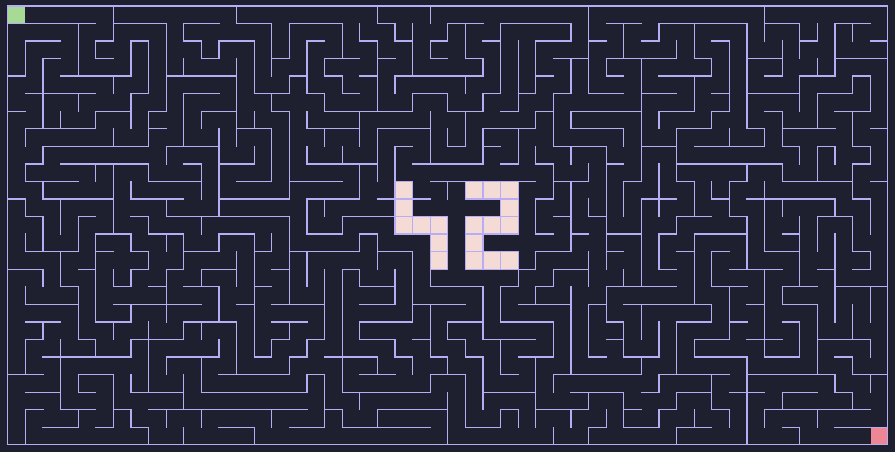

*This project has been created as part of the 42 curriculum by abounoua, arebilla*

# Project Name: A-Maze-ing

## Description
This project is a maze generation engine designed to explore fundamental concepts in Graph Theory and Algorithm Design. The primary goal is to transform an initial grid into a navigable structure by applying procedural generation techniques.

Building this tool serves as a practical application for several core computer science pillars:
- Graph Theory: Implementing "Perfect Mazes," which are technically Spanning Trees (graphs where any two nodes are connected by exactly one path, with no cycles).
- Algorithm Design: Using traversal or partitioning algorithms—such as Depth-First Search (DFS), Prim’s, or Kruskal’s—to create structured patterns from random states.
- Data Structures: Efficiently managing cell states and adjacencies to optimize generation speed, even for large-scale grids.
- Configuration Management: Decoupling logic from parameters by using an external configuration file to control the generation behavior.



---

## Instructions

### Installation
This project uses uv for dependency management: https://docs.astral.sh/uv/#installation

### Setup and run
```bash
make install # Install dependencies
make run     # Run the program based on config.txt
```

---

## Configuration File
The configuration is define in the `config.txt` file at the root of the project.
The configuration file accepts only the following parameters.

| Parameter | Format | Required | Example | 
| ----- | ----- | ----- | -----| 
| WIDTH | integer | yes | 10 |
| HEIGHT | integer | yes | 10 |
| ENTRY | line,column | yes | 0,0 |
| EXIT | line,column | yes | 9,9 |
| OUTPUT_FILE | string | yes | output.txt |
| PERFECT | boolean | no | True |
| SEED | integer | no | 512786 |

*Example:*
```bash
# config.txt
WIDTH=80
HEIGHT=80
ENTRY=0,0
EXIT=19,14
OUTPUT_FILE=maze.txt
PERFECT=True
SEED=512786
```

---

## Maze Generation
### Algorithm
#### Recursive Backtracking (Randomized Depth-First Search)

Complexity: $O(n)$


### Selection Rationale
[Explain why you chose this specific algorithm over others (e.g., complexity, visual style, efficiency).]

---

## Features
### Basic Features

```bash
a-maze-ing ~ help               # display available commands
a-maze-ing ~ exit               # exit program
a-maze-ing ~ maze               # display available sub-commands for maze
a-maze-ing ~ maze help          # display available sub-commands for maze
a-maze-ing ~ maze show          # display maze
a-maze-ing ~ maze info          # display maze information
a-maze-ing ~ maze regen         # generate a new maze
a-maze-ing ~ maze solve         # display maze solution
a-maze-ing ~ maze dump          # save maze to output file
```

### Advanced Features
```bash
a-maze-ing ~ theme              # display available themes
a-maze-ing ~ theme info         # display current theme
a-maze-ing ~ theme theme-name   # change theme to selected theme
a-maze-ing ~ algo               # display available algorithms
a-maze-ing ~ algo algo-name     # change algorithm and regenerate the maze
a-maze-ing ~ raycaster          # display available sub-commands for raycaster
a-maze-ing ~ raycaster help     # display available sub-commands for raycaster
a-maze-ing ~ raycaster start    # start maze exploration as first-person view
```

---

## Technical Implementation
### Reusability
[Specify which parts of your code are reusable and provide instructions on how to reuse them in other contexts.]

---

## Project Management

### Team Roles
[Define the specific roles and responsibilities of each team member.]

### Planning & Evolution
[Describe your anticipated planning and how it evolved throughout the project duration.]

### Retrospective
* **What worked well:** [List successful aspects of the collaboration or development.]
* **Areas for improvement:** [List what could have been handled better.]

### Tools Used

[List any specific tools used for version control, debugging, task management, etc.]

- [uv](https://docs.astral.sh/uv/) - package and project manager
- [Conventional Commits](https://www.conventionalcommits.org/en/v1.0.0/) - Specification for writing structured commit messages

---

## Resources
### References
[List classic references: documentation, articles, tutorials, etc.]
#### Maze Generation Algorithms
- [Fundamentals of Maze Generation - Carnegie Mellon University](https://www.cs.cmu.edu/~112-f22/notes/student-tp-guides/Mazes.pdf)
- [Maze Generation algorithm - Wikipedia](https://en.wikipedia.org/wiki/Maze_generation_algorithm)
- [The Buckblog, assorted ramblings - Jamis Buck](https://weblog.jamisbuck.org/2011/2/7/maze-generation-algorithm-recap.html)

#### Graph Theory
- [Théorie des graphes - Wikipedia](https://fr.wikipedia.org/wiki/Th%C3%A9orie_des_graphes)


### AI Usage Disclosure
[Provide a description of how AI was used, specifying the exact tasks and parts of the project it assisted with.]
